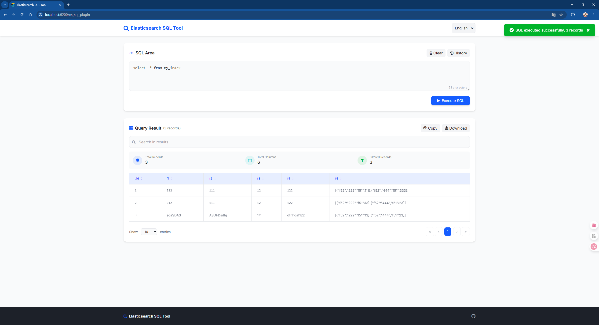

# Es Sql

[](https://www.apache.org/licenses/LICENSE-2.0.html)
[](https://github.com/elastic/elasticsearch)
[](https://github.com/antlr/antlr4)
[](https://github.com/alibaba/druid)
[]()
[](./doc/README-zh-CN.md)

## Introduction

Es SQL is a project that uses SQL syntax to operate [`Elasticsearch`](https://github.com/elastic/elasticsearch),
with [`Antlr4`](https://github.com/antlr/antlr4) component used for syntax parsing and [
`Druid`](https://github.com/alibaba/druid) for database connection pooling

## Builds

```shell
git clone https://github.com/junqiangChi/es-sql.git
mvn clean package install -DskipTests
```

## Elasticsearch Plugin

### Plugin Install

```shell
./bin/elasticsearch-plugin install file:///elasticsearch-sql-plugin.zip
```

### Plugin Usage

```
GET _es_sql
{
  "sql": "select * from myindex"
}
GET _es_sql/explain
{
  "sql": "select * from myindex"
}
POST _es_sql/explain
{
  "sql": "select * from myindex"
}
POST _es_sql
{
  "sql": "select * from myindex"
}
```

### Plugin Execute Page

After installing the plugin and restarting Elasticsearch, you can proceed to the following page to perform SQL queries

```
http://localhost:9200/es_sql_plugin
```

[]()

## EsJdbcConfig

Configuration parameters that can be set when using jdbc connection

| key                | default | type    | description                                |
|--------------------|---------|---------|--------------------------------------------|
| user               | (none)  | String  | Elasticsearch username                     |
| password           | (none)  | String  | Elasticsearch password                     |
| url                | (none)  | String  | Url eg：jdbc:elasticsearch://localhost:9200 |
| include.index.name | false   | Boolean | The query result include the index name    |
| include.doc.id     | false   | Boolean | The query result include the docId         |
| include.type       | false   | Boolean | The query result include the type          |
| include.score      | false   | Boolean | The query result include the score         |

## SQL Supported Features

- ✅ SELECT
    - ✅ FiELD ALIAS
    - ✅ CONSTANT FIELD
    - ✅ OPTIONAL FIELD
        - _id : DOC_ID
        - _index : INDEX_NAME
        - _type : INDEX_TYPE
        - _score : DOC_SCORE
    - ✅ NESTED FIELD
        - Nested fields do not support aggregation functions
    - ✅ FUNCTION
        - ✅LENGTH()
        - ✅LOWER()
        - ✅UPPER()
        - ✅SUBSTRING() | SUBSTR()
        - ✅TRIM()
        - ✅CONCAT() | CONCAT_WS()
        - ✅REPLACE()
        - ✅ABS()
        - ✅CEIL()
        - ✅FLOOR()
        - ✅ROUND()
        - ✅MOD()
        - ✅POW()
        - ✅SQRT()
        - ✅SQRT()
        - ✅RAND()
        - ✅CASE WHEN THEN ELSE END
        - ✅IF()
        - ✅IFNULL()
        - ✅COALESCE()
- ✅ WHERE
    - ✅ =
    - ✅ >
    - ✅ <
    - ✅ >=
    - ✅ <=
    - ✅ !=
    - ✅ IS
    - ✅ IS NOT
    - ✅ LIKE
    - ✅ NOT LIKE
    - ✅ IN
    - ✅ NOT IN
    - ✅ BETWEEN
    - ✅ NBETWEEN
    - ✅ REGEXP
    - ✅ NREGEXP
    - ✅ MATCH
    - ✅ MATCH_PHRASE
    - ✅ TERM
- ✅ ORDER BY
- ✅ GROUP BY
    - ✅ FUNCTION
        - ✅ COUNT()
        - ✅ MAX()
        - ✅ MIN()
        - ✅ SUM()
        - ✅ AVG()
- ✅ LIMIT
    - ✅ LIMIT 1
    - ✅ LIMIT 1, 5
- ✅ SHOW
    - ✅ SHOW TABLES
    - ✅ SHOW TABLES [FROM | IN] TABLE_NAME
    - ✅ SHOW TABLES LIKE 'PATTERN'
- ✅ INSERT INTO
    - ✅ INSERT INTO [TABLE] TABLE_NAME [(_id, F1, F2)] VALUES ('V1','V2','V3'), ('V4','V5','V6')
        - If the fields contains `_id`, the corresponding value is considered to be `doc_id`
- ✅ UPDATE
    - ✅ UPDATE TABLE_NAME SET F1 = 1, F2 = '2' BY 'doc_id'
    - ✅ UPDATE TABLE_NAME SET F1 = 1, F2 = '2' WHERE F3 = 3
- ✅ DELETE
    - ✅ DELETE FROM TABLE_NAME [WHERE]
        - If `WHERE` is empty, delete the entire index data
- ✅ DROP
    - ✅ DROP TABLE TABLE_NAME

## Create jdbc connection

### Use `Driver` or `Druid`  to create connections

```java
import java.sql.Connection;
import java.util.Properties;

import com.alibaba.druid.pool.DruidDataSource;
import com.alibaba.druid.pool.ElasticSearchDruidDataSourceFactory;

public class JdbcTest {

    @Test
    public void createConnectionWithDriver() {
        Class.forName("com.cjq.jdbc.EsDriver");
        String url = "jdbc:elasticsearch://localhost:9200";
        Properties properties = new Properties();
        properties.put("user", "");
        properties.put("password", "");
        Connection connection = DriverManager.getConnection(url, properties);
    }

    @Test
    public void createConnectionWithDruid() {
        Properties properties = new Properties();
        properties.put("url", "jdbc:elasticsearch://localhost:9200");
        properties.put("user", "");
        properties.put("password", "");
        DruidDataSource dds = (DruidDataSource) ElasticSearchDruidDataSourceFactory.createDataSource(properties);
        Connection connection = dds.getConnection();
    }
}
```
