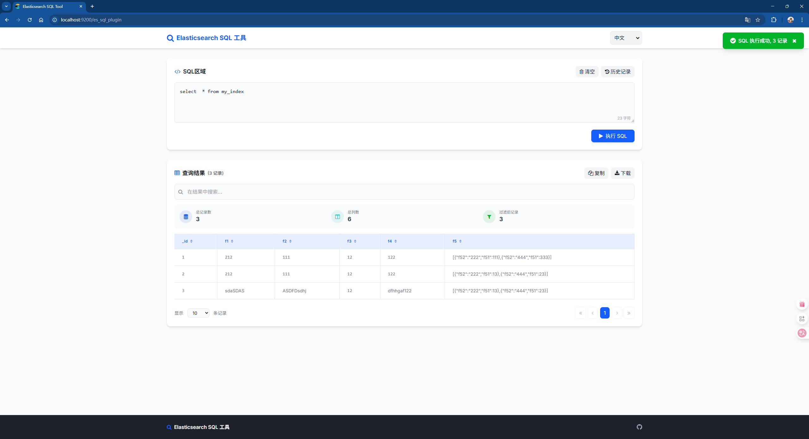

# Es-Sql

## 介绍

Es-Sql是使用SQL语法操作[`Elasticsearch`](https://github.com/elastic/elasticsearch)
的项目，其中语法解析使用了[`Antlr4`](https://github.com/antlr/antlr4)
组件，数据库连接池使用[`Druid`](https://github.com/alibaba/druid)。

## 构建

```shell
git clone https://github.com/junqiangChi/es-sql.git
mvn clean package install -DskipTests
```

## Elasticsearch 插件

### 插件安装

```shell
./bin/elasticsearch-plugin install file:///elasticsearch-sql-plugin.zip
```

### 插件使用

```
GET _es_sql
{
  "sql": "select * from myindex"
}
# 查看执行计划
GET _es_sql/explain
{
  "sql": "select * from myindex"
}
# 查看执行计划
POST _es_sql/explain
{
  "sql": "select * from myindex"
}
POST _es_sql
{
  "sql": "select * from myindex"
}
```

### 插件查询页面

安装完插件，重启elasticsearch后，可进行以下页面，进行sql查询

```
http://localhost:9200/es_sql_plugin
```

[]()

## EsJdbcConfig配置

使用Jdbc连接时可设置的配置参数

| 参数key              | 默认值    | 类型      | 描述                                               |
|--------------------|--------|---------|--------------------------------------------------|
| user               | (none) | String  | Elasticsearch用户名                                 |
| password           | (none) | String  | Elasticsearch用户密码                                |
| url                | (none) | String  | jdbc连接的Url，例：jdbc:elasticsearch://localhost:9200 |
| include.index.name | false  | Boolean | 查询结果是否包含索引名                                      |
| include.doc.id     | false  | Boolean | 查询结果是否包含doc_id                                   |
| include.type       | false  | Boolean | 查询结果是否包含类型                                       |
| include.score      | false  | Boolean | 查询结果是否包含score                                    |

## SQL语法支持特性

- ✅ SELECT
    - ✅ 字段别名
    - ✅ 常量字段
    - ✅ 可选字段名
        - _id : 文档ID
        - _index : 索引名
        - _type : 索引类型
        - _score : 文档分数
- ✅ WHERE
    - ✅ =
    - ✅ >
    - ✅ <
    - ✅ >=
    - ✅ <=
    - ✅ !=
    - ✅ IS
    - ✅ IS NOT
    - ✅ LIKE
    - ✅ NOT LIKE
    - ✅ IN
    - ✅ NOT IN
    - ✅ BETWEEN
    - ✅ NBETWEEN
    - ✅ REGEXP
    - ✅ NREGEXP
    - ✅ MATCH
    - ✅ MATCH_PHRASE
    - ✅ TERM
- ✅ ORDER BY
- ✅ GROUP BY
    - ✅ FUNCTION
        - ✅ COUNT()
        - ✅ MAX()
        - ✅ MIN()
        - ✅ SUM()
        - ✅ AVG()
- ✅ LIMIT
    - ✅ LIMIT 1
    - ✅ LIMIT 1, 5
- ✅ SHOW
    - ✅ SHOW TABLES
    - ✅ SHOW TABLES [FROM | IN] TABLE_NAME
    - ✅ SHOW TABLES LIKE 'PATTERN'
- ✅ INSERT INTO
    - ✅ INSERT INTO [_id, F1, F2] TABLE_NAME VALUES ('V1','V2','V3'), ('V4','V5','V6')
        - 如果字段名中包含`_id`,则认为对应值为`文档ID`
- ✅ UPDATE
    - ✅ UPDATE TABLE_NAME SET F1 = 1, F2 = '2' BY 'doc_id'
    - ✅ UPDATE TABLE_NAME SET F1 = 1, F2 = '2' WHERE F3 = 3
- ✅ DELETE
    - ✅ DELETE FROM TABLE_NAME [WHERE]
        - 如果`WHERE`是空, 则会删除整个索引的数据
- ✅ DROP
    - ✅ DROP TABLE TABLE_NAME

## 创建jdbc连接

### Driver和Druid两种创建连接方式

```java
import java.sql.Connection;
import java.util.Properties;

import com.alibaba.druid.pool.DruidDataSource;
import com.alibaba.druid.pool.ElasticSearchDruidDataSourceFactory;

public class JdbcTest {

    @Test
    public void createConnectionWithDriver() {
        Class.forName("com.cjq.jdbc.EsDriver");
        String url = "jdbc:elasticsearch://localhost:9200";
        Properties properties = new Properties();
        properties.put("user", "");
        properties.put("password", "");
        Connection connection = DriverManager.getConnection(url, properties);
    }

    @Test
    public void createConnectionWithDruid() {
        Properties properties = new Properties();
        properties.put("url", "jdbc:elasticsearch://localhost:9200");
        properties.put("user", "");
        properties.put("password", "");
        DruidDataSource dds = (DruidDataSource) ElasticSearchDruidDataSourceFactory.createDataSource(properties);
        Connection connection = dds.getConnection();
    }
}
```
